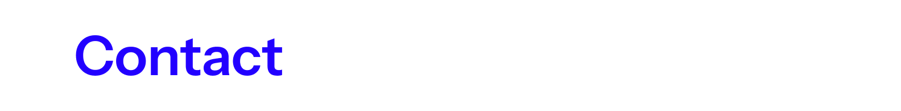

<h1 align="center">Hi, I'm Dimas 👋</h1>

  CS student at UQ &amp; ITS • Data &amp; Media Enthusiast

  <!-- Replace this with your own "About Me" image -->
  

I'm a computer science student from Indonesia who enjoys turning data into clear stories. I have a background in media, content creation, and UI design, and I'm working towards becoming a data analyst.

  <!-- Replace this with your own tech/tools image (e.g., icons for Python, SQL, Java, React, Figma) -->
  

  

  

  

  

  

  <!-- Replace this with your own contact image (e.g., email / LinkedIn icons) -->
  

  📧 <a href="mailto:dimasgisthaa@gmail.com">dimasgisthaa@gmail.com</a>

